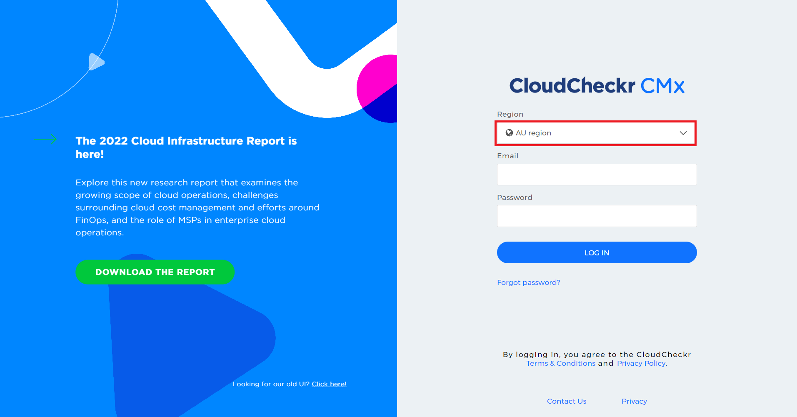

# ⁉️ CloudCheckr 퀵 가이드

CloudCheckr 데모 영상 (Youtube) 

스마일샤크에서 제작한 CloudCheckr 가이드 영상을 유튜브에서 확인할 수 있습니다.&#x20;

하단의 링크를 통해 접속 가능합니다.&#x20;

[https://www.youtube.com/watch?v=yVGX0RKvxp4](https://www.youtube.com/watch?v=yVGX0RKvxp4)

[Q1] CloudCheckr CMx 접속방법

클라우드체커 CMx에 접속하는 방법은 다음과 같습니다.

1. [https://app-au.cloudcheckr.com/](https://app-au.cloudcheckr.com/)로 이동합니다.
2. Au region를 확인 후 로그인합니다.
3.

    <figure><figcaption></figcaption></figure>

* CloudCheckr 계정은 스마일샤크와 AWS 파트너 계약시 설문조사를 통해 요청한 Email을 ID로 사용하며 계정 발급시 신청하신 CloudCheckr 계정 Email로 비밀번호 설정 안내가 발송 됩니다.

[Q2] 빠르게 체커 기능들에 접근하고 싶습니다.

왼쪽 탐색 창을 사용하지 않고도 체커에 있는 특정 기능들을 검색해서 찾을 수 있는 방법을 소개합니다.

1. **CloudCheckr** 접속화면 상단 돋보기 옆을 클릭합니다.
2. Search pages 안에 검색할 기능을 입력합니다.

*

    
<figure><figcaption>
빨간색 상자 안 돋보기 옆 클릭
</figcaption></figure>

-

    <figure><figcaption>
Search pages에서 원하는서비스 입력
</figcaption></figure>

*

    <figure><figcaption>
Cost 검색 예시
</figcaption></figure>

[Q3] 계정을 어디서 확인할 수 있나요?

계정은 맨 오른쪽 상단에서 확인이 가능합니다.\
다음은 계정 확인하는 방법입니다.

1. 빨간색 상자 안 **Customers** 옵션을 클릭합니다.

*

    
<figure><figcaption>
맨 오른쪽 상단 customers 옵션 클릭
</figcaption></figure>

-

    <figure><figcaption>
Accounts &#x26; MAVs 항목 확인 가능
</figcaption></figure>

**Customers** 옵션에서 확인할 수 있는 두가지 항목은 다음과 같습니다.

* **Accounts** → 사용하고 있는 단일 AWS 계정 관리
* **MAVs**→ 사용하고 있는 모든 AWS 계정 통합 관리

**MAVs** 옵션은 여러 계정을 사용하고 있을 때 한눈에 계정을 파악할 수 있는 유용한 옵션입니다. 하지만 단일 계정을 사용하는 경우에는 **Accounts** 에서 단일 계정을 파악할 수 있습니다.

[Q4] 비밀번호를 분실했습니다.

비밀번호 재설정 하는 방법은 다음과 같습니다.

*

    <figure><figcaption>
체커 실행 후 로그인 화면에 접속
</figcaption></figure>

1. **Forgot password**을 클릭합니다.
2. 계정 발급 시 신청한 **CloudCheckr** 계정 **Email**을 입력합니다.
3. 발급된 이메일 메일함에 아래와 같은 메일을 확인할 수 있습니다.
4. 받은 키를 복사해서 입력합니다.
5. 비밀번호를 재 설정 합니다.
6. 비밀번호 변경이 완료되면 **Password Set Successful&#x20;**<mark style="color:green;">**V**</mark>이 나옵니다.

추가적인 클라우드체커 문의사항은 [스마일샤크 테크서포트 센터](https://smilesharkhelp.zendesk.com/hc/ko)를 통해 문의해 주시기 바랍니다.

[Q5] 비용 상세 분석 사용 예시가 있을까요?

다음은 기간, 리전 및 서비스를 특정해서 선택하고 사용량을 AWS 비용 상세 분석을 통해 확인하는 방법입니다.\
**Cost → AWS Billing → Custom Reporting → Advanced Grouping**으로 접속합니다.

*

    <figure><figcaption>
Advanced Grouping 접속 화면
</figcaption></figure>

-

    <figure><figcaption>
&#x3C;2023년 1월 18일 부터 2023년 2월 1일 서울 리전, EC2 선택 예시>
</figcaption></figure>
- **Group By**
  * **Region, Service, Description** 선택
- 날짜
  * **Start** → 시작 날짜
  * **End** → 마치는 날짜
- **Region**
  * 서울 리전 **Asia Pacific (Seoul)** 선택
  * 기본 선택 시 모든 리전 확인 가능
- **AWS Service**
  * **EC2** 선택
  * 기본 선택 시 모든 서비스 확인 가능
- **Filter**를 클릭합니다.

*

    <figure><figcaption>
Filter 결과값 예시
</figcaption></figure>

다음은 Tag를 활용하여 비용 상세 분석을 확인하는 방법입니다.

*

    <figure><figcaption>
Tag를 Service로 태깅 및 Filter By Tags에서 특정 value를 선택한 예시
</figcaption></figure>

    **Tag Key:**&#xB85C; 분류하기 위해서는 AWS에서 리소스에 태깅이 돼야 하며 태그가 체커 내에 적용되기까지 2\~3일까지 소요될 수 있습니다.

- **Group By**
  * **Tag Key: service** (AWS 내 태그 key 값이 service로 생성된 경우)
  * **Service** 선택 시 어떤 리소스 사용 중인지 확인 가능
- 날짜
  * **Start** → 시작 날짜
  * **End** → 마치는 날짜
-   **Filter By Tags**

    * 확인하려는 태그의 key와 value를 직접 선택

    **3 옵션 중 하나선택**

    * **Show costs that have ALL these tags** -> 이 태그가 모두 포함된 비용 표시 **(기본값)**
    * **Show costs that have ANY of these tags** -> 다음 태그 중 하나라도 포함된 비용 표시\
      &#xNAN;**(태그의 key와 value를 직접 선택 시 이 옵션 선택)**
    * **Exclude costs that have ANY of these tags** -> 다음 태그 중 하나라도 포함된 비용 제외
- **AWS Service**
  * 확인할 리소스만 선택 (예: EC2에 태깅한 경우 EC2만)
  * 기본 선택 시 모든 서비스 확인 가능
- **Filter**를 클릭합니다.
-

    <figure><figcaption>
Filter 결과값 예시
</figcaption></figure>

특정 태그를 검색하는 방법 이외의 나머지 옵션들은 기존 비용 상세 분석 사용방법과 동일합니다.

[Q6] 체커 금액이 실시간으로 반영이 되나요?

체커에서는 금액을 실시간으로 반영하지 않습니다.

체커에서 확인 가능한 금액은 확인하는 날로부터 2\~3일전 금액까지만 확인이 가능합니다.

AWS 및 클라우드체커에서는 타임존 기준을 UTC로 잡고 있지만, 한국은 UTC보다 +9시간 빠르고 AWS 사용금액은 실시간으로 반영되는 것이 아닌 AWS에서 자체적으로 집계하는 시간인 최소 8시간에서 하루정도 데이터가 쌓이는 시간 그리고 클라우드체커에서 AWS로부터 데이터를 가져와서 반영하는 시간 또한 따로 있기 때문에 2\~3일 전 금액까지 정확하게 확인이 가능합니다.

금액 뿐만 아니라, AWS에서 집계되는 모든 데이터는 체커에서 실시간으로 반영되는 것이 아닌 시간을 두고 적용됩니다.

