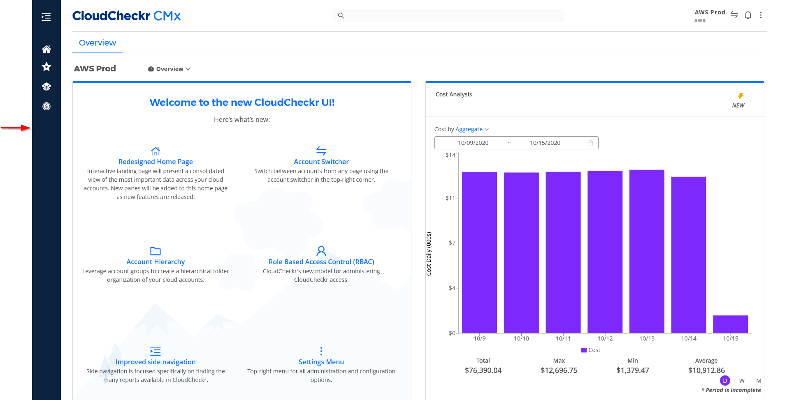

# CMx 탐색창

왼쪽 탐색 창은 모듈 또는 기능별로 **CloudCheckr** 보고서를 구성합니다.

<figure><figcaption>
초기화면 기준 왼쪽에서 확인 가능
</figcaption></figure>

왼쪽 탐색 창은 설정 메뉴 옵션에 액세스할 때를 **제외하고 CloudCheckr**의 모든 페이지에서 볼 수 있습니다.

Callout을 가이드로 사용하여 표를 검토하여 왼쪽 탐색 창의 기능에 대해 자세히 알아보십시오.

<figure><figcaption>
왼쪽에 위치한 탐색창
</figcaption></figure>

<table data-header-hidden><thead><tr><th width="135.33333333333331"></th><th width="262"></th><th></th></tr></thead><tbody><tr><td>Callout</td><td>기능 이름</td><td>설명</td></tr><tr><td>1</td><td>Dock icon</td><td>메뉴 옵션을 고정/해제 하도록 전환합니다.</td></tr><tr><td>2</td><td>Home</td><td>응용 프로그램의 아무 곳에서나 홈 화면 으로 돌아가려면 클릭하십시오 .</td></tr><tr><td>3</td><td>Favorites</td><td>즐겨찾기에 추가한 보고서 목록을 보려면 클릭하십시오.</td></tr><tr><td>4</td><td>Resources</td><td>인벤토리 요약, 태그가 지정된 리소스, 트렌드, 맵 오버레이 및 사용자 정의 인벤토리 보고서에 대한 보고서가 포함된 리소스 모듈에 액세스하려면 클릭합니다.</td></tr><tr><td>5</td><td>Cost</td><td>비용 경고, 지출 분석, 예약 사용량, 태깅 및 쇼백 저장과 관련된 보고서 및 기능이 포함된 비용 모듈에 액세스하려면 클릭하십시오.</td></tr></tbody></table>
