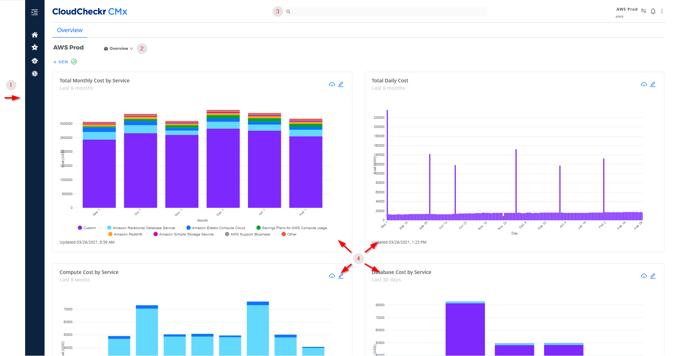
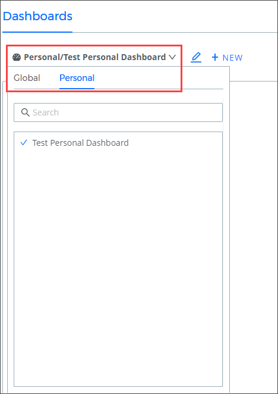

# CMx 초기화면

초기화면 페이지는 **CloudCheckr CMx**에 로그인한 후 표시되는 첫 번째 페이지입니다. 홈페이지에서는 **CloudCheckr**의 주요 기능 및 보고서에 빠르게 액세스할 수 있으므로 클라우드 환경을 보다 쉽게 ​​관리할 수 있습니다.

<figure><figcaption>
접속 시 확인 가능한 초기화면
</figcaption></figure>

<table data-header-hidden><thead><tr><th width="161"></th><th width="157.33333333333331"></th><th></th></tr></thead><tbody><tr><td>Callout</td><td>기능</td><td>설명</td></tr><tr><td>1</td><td><a href="cmx-1.md">탐색 창</a></td><td>비용, 청구, 리소스, 자동화, 보안 및 규정 준수와 같은  모듈별로 CloudCheckr 보고서를 구성합니다.</td></tr><tr><td>2</td><td> 대시보드 메뉴</td><td>기존 CloudCheckr (구UI) 또는 CloudCheckr CMx에서 대시보드를 만든 경우 드롭다운 목록에서  기존 대시보드를 선택할 수 있습니다.</td></tr><tr><td>3</td><td><a href="undefined.md">머리글 표시줄</a></td><td>검색 및 계정 전환기와 같은 탐색 도구와 알림 메시지 및 설정 메뉴가 포함되어 있습니다.</td></tr><tr><td>4</td><td><a href="../cmx/undefined-1.md">대시보드 창</a></td><td>클라우드 비용의 스냅샷을 제공하는 비용 대시보드를  생성, 사용자 지정 또는 확인합니다.</td></tr></tbody></table>
