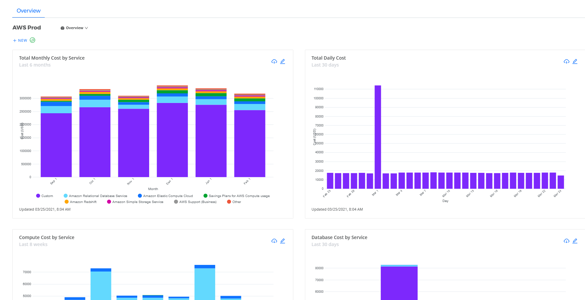
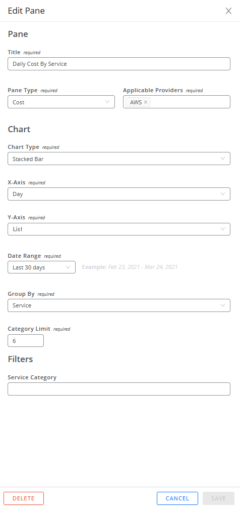

# 대시보드 창

CMx 대시보드를 사용하면 모든 각도에서 클라우드 데이터를 검사하고 해당 데이터를 파악할 수 있음으로 특정 데이터 센터 지역에서 클라우드 서비스에 얼마나 많은 비용을 지출하고 있는지와 같은 세세한 정보를 확인하는 데 도움이 됩니다. CMx 대시보드 창을 사용하면 사용자를 위한 사용자 친화적인 시각적 요약을 만들 수 있습니다.

<figure><figcaption>
초기 대시보드 예시
</figcaption></figure>

## 새 대시보드 창 만들기

1. 홈 페이지 왼쪽의 <mark style="color:blue;">**+**</mark> <mark style="color:blue;">**NEW**</mark> 버튼을 클릭 하고 드롭다운 메뉴에서 **New Pane**을 선택합니다.

<figure><figcaption>
왼쪽 상단에 위치한 +NEW 클릭
</figcaption></figure>

New Pane이 열립니다. 사용 가능한 필드 및 설정은 선택한 차트 유형에 따라 다릅니다.

<figure><figcaption>
+NEW 버튼 클릭시 확인 가능
</figcaption></figure>

2. 필수 항목 (required)를 선택합니다.


선택한 창 유형에 따라 표시되는 데이터 필드와 필수 또는 선택 항목이 결정됩니다.


<table data-header-hidden><thead><tr><th width="148"></th><th></th></tr></thead><tbody><tr><td><strong>Field</strong> (필드)</td><td><strong>목적</strong></td></tr><tr><td>Title (제목)</td><td>대시보드 창의 이름을 입력합니다. CloudCheckr CMx는 왼쪽 상단 모서리에 표시합니다.</td></tr><tr><td>Pane Type (창 유형)</td><td>
창 유형 드롭다운 메뉴에서 창 유형을 선택합니다.

창 유형에 따라 특정 구성 옵션을 사용할 수 없는 경우도 있습니다.
</td></tr><tr><td>Applicable Providers</td><td>AWS 선택합니다. (기본 값)</td></tr><tr><td>Chart Type (차트 유형)</td><td>
차트 유형 드롭다운 메뉴에서 다음 차트 형식 중 하나를 선택합니다.
<ul><li>Area - Stacked 영역 - 누적(축과 각 선 사이의 영역은 데이터 하위 범주를 나타냅니다. 각 영역은 다른 색상으로 표시되고 다른 영역 위에 누적됨)</li><li>
Donut 도넛(각 조각의 크기는 데이터 범주의 비율을 나타냄)

<mark style="background-color:red;">범주 값이 0 이하인 경우 CloudCheckr CMx는 차트와 범례에서 해당 범주를 기타 로 그룹화합니다. (스크린샷 참조)</mark>

<figure><figcaption></figcaption></figure>
</li><li>Line - Series 라인 - 시리즈(정보를 직선 세그먼트로 연결된 일련의 데이터 포인트로 표시)</li><li>Table 테이블(데이터 요소를 쉽게 비교할 수 있도록 데이터를 행과 열로 표시)</li></ul>
  <mark style="background-color:red;"><strong>Table  옵션을</strong> 선택하면 데이터를 .PNG 형식으로 내보낼 수 없습니다.</mark>
<ul><li>Vertical Bar 세로 막대 - 누적형(각 막대는 범주 내의 하위 범주 값을 나타냅니다. 각 하위 범주는 수직으로 다른 막대 위에 쌓입니다.) </li><li>Vertical Bar 세로 막대 - 100% 누적(각 막대는 범주 내 하위 범주의 백분율을 나타내므로 각 하위 범주의 합계는 100이 됩니다.) </li><li>Vertical Bar 세로 막대 - 계열(각 막대는 선택한 범주의 값을 나타냄)</li></ul></td></tr><tr><td>X-Axis</td><td>X축 드롭다운 메뉴에서 그래프의 x축에 표시할 속성을 선택합니다.</td></tr><tr><td>Y-Axis</td><td>Y축 드롭다운 메뉴에서 그래프의 y축에 표시할 비용 유형을 선택합니다.</td></tr><tr><td>Column Headings (열 제목)</td><td>
열 머리글 드롭다운 메뉴에서 테이블 데이터를 필터링할 기본 데이터 포인트를 선택합니다. 이 데이터는 테이블의 열에 표시됩니다.

행 및 열 교체 버튼을 클릭하여 행 및 열 머리글의 선택 항목을 뒤집어 데이터를 다르게 표시할 수 있습니다. (테이블만)
</td></tr><tr><td>Group By  or Row Headings</td><td>
그룹화 기준 또는 행 머리글 드롭다운 메뉴에서 다음 속성 중 하나를 선택하여 데이터를 더 세분화합니다. 이 데이터는 테이블의 행에 표시됩니다.

행 및 열 교체 버튼을 클릭하여 행 및 열 머리글의 선택 항목을 뒤집어 데이터를 다르게 표시할 수 있습니다. (테이블만)
<ul><li><strong>Aggregate:</strong> 선택한 데이터의 총 비용입니다.</li><li><strong>Unique ID - Account-Friendly Name:</strong> CloudCheckr CMx 계정의 고유 ID 또는 Account-Friendly-Name(사용 가능한 경우)입니다.</li><li>Service Category: CloudCheckr CMx의 관련 서비스에 대한 컨테이너입니다.</li><li><strong>Service:</strong> 배포를 최적화하도록 설계된 클라우드 기반 제품입니다.</li><li><strong>Location:</strong> 비용 분석에 집중하려는 지리적 지역입니다.</li><li><strong>Service Sub-Type:</strong> 선택한 서비스 내의 기능 하위 집합입니다.</li><li><strong>Tag:</strong> 시스템의 특정 태그를 기반으로 데이터를 사용자 지정하는 데 사용할 수 있는 태그 키 목록입니다.</li></ul></td></tr><tr><td>Date Range (날짜 범위)</td><td>
Date Range 드롭다운 메뉴에서 기본 제공 날짜 범위 중 하나를 선택하거나 사용자 지정 날짜 범위를 선택합니다.

</td></tr><tr><td>Category Limit (카테고리 제한)</td><td>
이 필드는 Group By 속성을 선택한 경우에만 선택할 수 있습니다.

위쪽 또는 아래쪽 화살표를 클릭하여 숫자를 선택합니다.

<strong>Category limit</strong>은 지출 순으로 정렬된 차트에 표시하려는 범주 수를 나타냅니다. CloudCheckr CMx는 다른 모든 카테고리를 <strong>Other</strong>로 그룹화합니다.
</td></tr><tr><td>Service Category (서비스  카테고리)</td><td>서비스 범주 드롭다운 메뉴에서 목록의 서비스 범주를 선택하거나 나열된 서비스 범주 중 하나로 필터링하지 않으려면 <strong>uncategorized</strong>를 선택합니다. 이는 포괄적인 목록으로, 현재 범주에 대한 비용 또는 사용량 데이터가 없는 경우에도 범주가 표시될 수 있음을 의미합니다.</td></tr><tr><td>Resource Tags (리소스 태그)</td><td>태그 키-값 조합으로 필터링하면 특정 정보에 대한 대시보드 창을 사용자 지정할 수 있습니다. 키 드롭다운 메뉴의 목록에서 <strong>Tag Key</strong>를 선택한 다음 연결된 <strong>Value</strong>를 선택합니다. <strong>New Key and Values</strong> ​​버튼을 클릭하면 동일한 태그 키를 다른 값으로 여러 번 선택할 수 있습니다.</td></tr></tbody></table>

3. **SAVE** 를 클릭합니다.

초기화면의 새 창은 새 창을 만들고 있음을 나타내는 메시지를 표시합니다.

<figure><figcaption>
Gathering data and building your chart. 메시지 확인가능
</figcaption></figure>

시스템이 분할창 작성을 완료하면 새 시각화가 표시됩니다.

<figure><figcaption>
적용이 완료된 대시보드
</figcaption></figure>

## **대시보드 창 편집**

다음 단계에 따라 대시보드 패널을 수정할 수 있습니다.

1.  수정하려는 창에서 **Edit** 버튼 을 클릭합니다. 편집 창 하위 서랍이 열립니다. \
    이 예에서는 첫 번째 절차에서 생성한 Daily Cost By Service 창을 편집해 보겠습니다.\

    <figure><figcaption>
Edit 버튼 클릭시 확인 가능
</figcaption></figure>
2. 창 옵션을 변경하고 **SAVE**를 클릭합니다.


**DELETE**를 클릭하여 개요 대시보드에서 창을 제거 할 수도 있습니다. 이 작업은 취소할 수 없습니다. **CANCEL**을 클릭하여 원래 구성한 창을 그대로 두고 개요 대시보드 페이지로 돌아갈 수도 있습니다.


## **대시보드 창 데이터 요소 분리**

패널 시각화를 사용하면 그래프의 특정 데이터 포인트에 집중하여 자세한 내용을 볼 수 있습니다.\
그래프의 데이터 포인트 위로 마우스를 가져가면 특정 세부 정보를 볼 수 있습니다.

이 예시에서는 이 그래프의 세 번째 누적 막대에 있는 연한 파란색 섹션 위에 커서를 놓았습니다.

<figure><figcaption>
커서로 확인 가능
</figcaption></figure>

## **대시보드 창 내보내기**

창을 CSV 파일이나 PNG 형식으로 내보낼 수 있습니다.

1. 내보낼 데이터가 있는 창에서 **Export** 버튼을 클릭합니다.
2.  **Export data to CSV** 또는 **Export pane to PNG**를 선택합니다.

    <figure><figcaption>
맨 오른쪽 상단에 위치한 버튼 클릭
</figcaption></figure>
