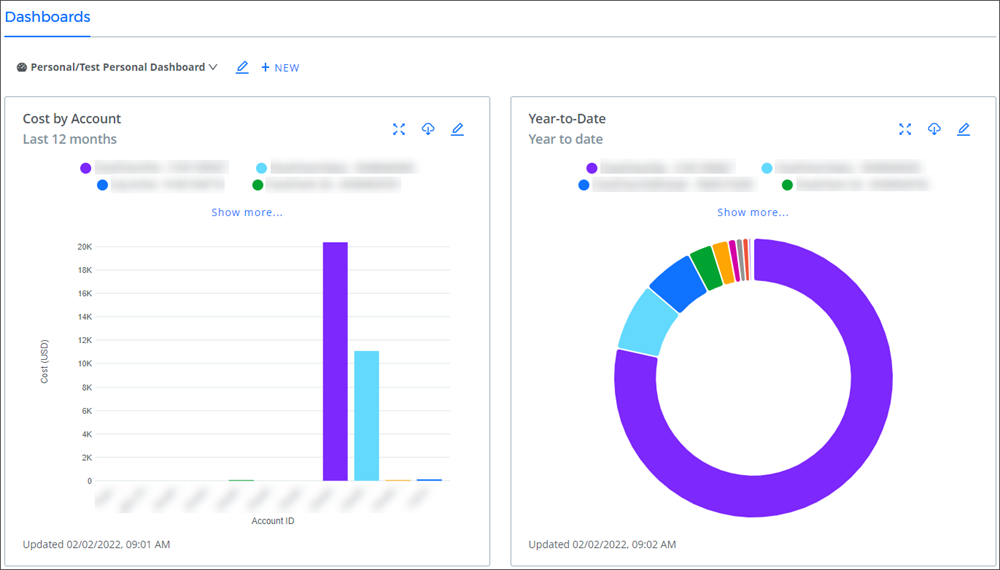
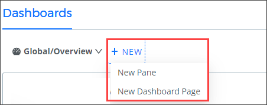

# 개인 대시보드 생성

CMx 대시보드는 개인 대시보드를 사용하여 사용자 지정이 가능합니다. 비용 데이터 및 보고서에 액세스할 수 있는 모든 사용자가 자신의 대시보드를 만들 수 있습니다.

<figure><figcaption>
직접 수정이 가능한 대시보드
</figcaption></figure>

## **개인 대시보드 만들기**

1. CMx 대시보드 초기화면에서 <mark style="color:blue;">**+ New**</mark> 버튼을 클릭하고 **New Dashboard Page**를 선택합니다 .

<figure><figcaption>
버튼 클릭시 확인 가능한 옵션
</figcaption></figure>

2. 창 오른쪽에 있는 새 대시보드 서랍에 이름과 설명을 제공합니다. \
   기본적으로 유형 드롭다운 메뉴에는 **Personal**이 선택되어 있습니다.

<figure><figcaption>
Dashboard Name에 이름 입력
</figcaption></figure>

3.  **Save**를 클릭합니다. 새로운 개인 대시보드는 Dashboards 드롭다운 메뉴의 _Personal_ 에 표시됩니다.\

    <figure><figcaption>
'Test Personal Dashboard' 확인 가능
</figcaption></figure>

이제 시각화 및 데이터 창을 대시보드에 추가할 준비가 되었습니다. 대시보드 창을 만들고 편집하는 방법에 대한 자세한 내용은 [대시보드 창](undefined-1.md)을 참조하십시오.
