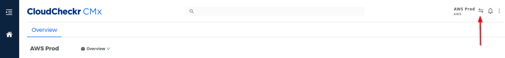

# 계정 전환

계정 전환을 사용하면 프로젝트에서 다른 계정 또는 다중 계정 보기(MAV)로 빠르게 전환할 수 있습니다.

애플리케이션의 모든 페이지에 있는 [머리글 표시줄](cloudcheckr-cmx/undefined.md)에서 계정 전환기를 찾을 수 있으므로 사용 중인 보고서 또는 기능에 관계없이 계정 또는 MAV를 변경할 수 있습니다.

<figure><figcaption>
화면 맨 오른쪽 빨간색 화살표쪽으로 이동
</figcaption></figure>

## **계정 선택**

**예시)** 현재 계정은 **Onboarding** 이지만 고객은 **Nimbus IT** 계정으로 전환하려고 합니다.

1. 머리글 표시줄에서  클릭합니다.
2.  모달 창이 열립니다.\

    <figure><figcaption>
열린 모달 창 예시
</figcaption></figure>
3.  Customers 아래에 **john@nimbus.com**을 입력하여 John의 계정만 표시되도록 합니다.\

    <figure><figcaption>
john@nimbus.com 계정 확인 가능
</figcaption></figure>
4. 선택한 계정의 이름 입력해서 계정 목록을 필터링 할 수도 있습니다.
   * 예시에서는 **Nimbus IT**를 입력하여 해당 검색어와 일치하는 계정만 포함하도록 목록을 필터링 했습니다.

<figure><figcaption>
필터링된 화면 예시
</figcaption></figure>

5. 계정 행을 클릭하여 선택한 계정으로 드릴다운합니다.

<figure><figcaption>
노란색 박스안 계정 클릭
</figcaption></figure>

모달 창이 닫힙니다. **CloudCheckr CMx**는 작업 중이던 페이지로 돌아가며 Nimbus IT 계정을 보고 있음을 나타냅니다.

<figure><figcaption>
Nimbus IT 계정 확인 화면 예시
</figcaption></figure>
