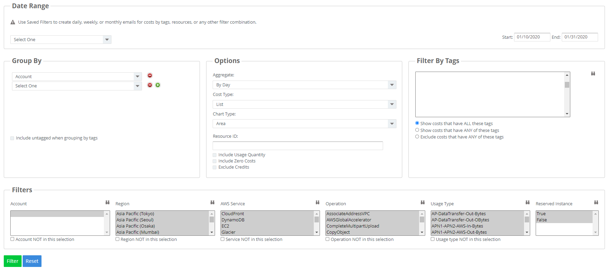
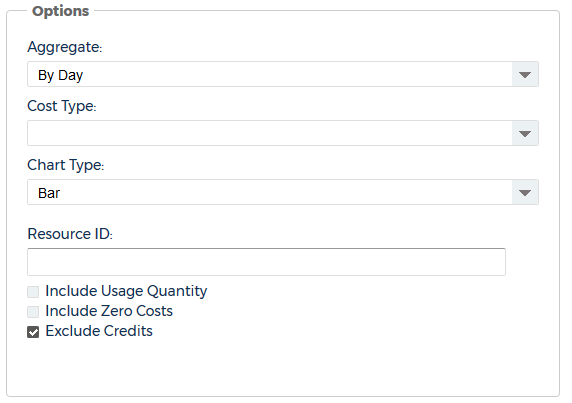

# AWS 비용 상세 분석

비용 상세 분석을 사용하면 여러 범주별로 비용을 그룹화할 수 있으므로 보다 자세한 비용 결과를 생성할 수 있습니다.

이 보고서에 액세스하려면 왼쪽 탐색 창으로 이동하여\
**Cost > AWS Billing > Custom Reporting > Advanced Grouping**을 선택합니다.

<figure><figcaption>
Advanced Grouping 접속 화면
</figcaption></figure>

## 옵션 설명

AWS 비용 상세 분석 보고서에서 설명할 옵션은 다음과 같습니다.

### Group By

**Group By** 에서는 검색을 그룹화할 기준을 선택하는 곳입니다.

<figure><figcaption>
Group By 예시
</figcaption></figure>

선택할 수 있는 검색 기준 목록은 다음과 같습니다.

<table><thead><tr><th width="337">옵션</th><th>설명</th></tr></thead><tbody><tr><td>Account (계정)</td><td>비용 데이터의 소스인 AWS 계정</td></tr><tr><td>Availability Zone (가용 영역)</td><td>동일한 지역의 다른 가용 영역에 네트워크 연결을 제공할 수 있는 지역 내의 격리된 위치</td></tr><tr><td>Description (설명)</td><td>선택한 라인 항목에 대한 사용 유형 및 평균 가격</td></tr><tr><td>EC2 Instance ID (인스턴스 ID)</td><td>AWS가 각 EC2 인스턴스에 할당하는 고유 식별자</td></tr><tr><td>Month (월)</td><td>검색 기준으로 삼고자 하는 선택된 달</td></tr><tr><td>Operation (작업)</td><td>라인 항목의 특정 용도를 설명하는 특정 AWS 작업입니다. 예를 들어 <mark style="color:red;"><code>RunInstances</code></mark>는 Amazon EC2 인스턴스의 작업을 나타냅니다.</td></tr><tr><td>Region (지역)</td><td>동일한 지리적 영역에 있는 명명된 AWS 리소스 세트</td></tr><tr><td>Reserved Instance (예약 인스턴스)</td><td>특정 기준을 충족하는 인스턴스에 대한 온디맨드 사용 요금을 할인하는 EC2 인스턴스 요금 옵션</td></tr><tr><td>Resource ID (리소스 ID)</td><td>선택한 AWS 리소스의 고유 식별자</td></tr><tr><td>Service (서비스)</td><td>일련의 작업을 수행하기 위한 인프라, 빌딩 블록 및 도구를 제공하는 AWS 오퍼링</td></tr><tr><td>Usage Type (사용 유형)</td><td>라인 항목에 대한 사용 세부 정보입니다. 예를 들어<mark style="color:red;"><code>USW2-BoxUsage:m2.2xlarge</code></mark> 는 미국 서부(오레곤) 리전의 M2 고용량 메모리 이중 초대형 인스턴스를 설명합니다.</td></tr><tr><td>Week (주)</td><td>검색 기준으로 삼고자 하는 선택된 주</td></tr><tr><td>Tag Key (태그 키)</td><td>검색 결과를 구체화하기 위해 리소스에 할당할 수 있는 특정 값</td></tr></tbody></table>

데이터에 대해 최대 5개 수준의 그룹화를 선택할 수 있습니다.


선택한 옵션이 많을 시 검색이 느리거나 불가할 수 있습니다. (2\~3개 정도의 옵션 권장)


그룹화에 레벨을 추가하려면 를 클릭하십시오.

그룹화에서 레벨을 삭제하려면를 클릭합니다.

검색 기준의 일부로 태그가 지정되지 않은 리소스를 포함하려면 태그로 그룹화할 때\
**Include untagged when grouping by tags** 체크박스를 선택합니다.

### Options

**Options** 에서는 검색에서 비용 데이터를 구체화할 수 있습니다.

<figure><figcaption>
Options 예시
</figcaption></figure>

다음 매개변수를 구성할 수 있습니다.

* **Aggregate**: **CloudCheckr**가 보고서의 비용 데이터를 매일, 매주 또는 매월 간격으로 내보내도록 하려면 선택합니다. 이것은 내보낸 데이터가 집계되는 방식에만 영향을 미치며 화면의 합계에는 영향을 주지 않습니다.
* **Chart Type**: **CloudCheckr**가 데이터를 표시하는 방법을 식별합니다. 차트 옵션에는 영역, 막대, 열 또는 파이가 포함됩니다.
* **Include Usage Quantity**: 특히 리소스 ID 또는 EC2 인스턴스 ID로 그룹화하는 경우 사용량에 대한 추가 열을 생성하려면 선택합니다.
* **Include Zero Costs**: 총 비용이 0인 행을 포함하려면 선택합니다.
* **Exclude Credits**: 보고서를 생성할 때 크레딧을 제외하려면 선택합니다.

### Filter By Tags

**Filters By Tags** 섹션에서는 검색을 특정 태그로 제한할 수 있습니다.

계정에 태그가 적은 경우(5,000개 미만) **CloudCheckr**는 필터에 적용할 태그를 선택할 수 있는 목록 상자를 표시합니다. 전체 태그 목록에서 를 클릭하여 선택할 수도 있습니다.

<figure><figcaption>
Filter By Tags 예시
</figcaption></figure>

계정에 태그가 많은 경우(5,000개 이상)  <mark style="color:blue;">**You have a large number of tags**</mark> 링크가 나옵니다.

<figure><figcaption>
<strong>You have a large number of tags</strong> 링크 예시
</figcaption></figure>

링크를 클릭하면 필터에 적용할 하나 이상의 태그 키 및 값 쌍을 선택할 수 있는 **Lookup Tags**(조회 태그 대화 상자)가 열립니다.

<figure><figcaption>
 <strong>Lookup Tags</strong>(조회 태그 대화 상자) 예시
</figcaption></figure>

태그 검색을 세분화하여 모든 태그가 있는 비용, 태그가 있는 비용 또는 태그가 없는 비용을 표시할 수도 있습니다.

### **Filters**

**Filters** 에서는 검색에 포함할 특정 매개변수를 선택할 수 있습니다.

<figure><figcaption>
Filters 예시
</figcaption></figure>

사용 가능한 필터에 대한 자세한 내용은 위에 **Group by** 섹션의 테이블을 참조하십시오.

구체적인 리전 및 서비스를 선택해서 사용량을 확인하려면 [여기](../../cloudcheckr-cmx/cloudcheckr.md#q4)를 참조하세요.
