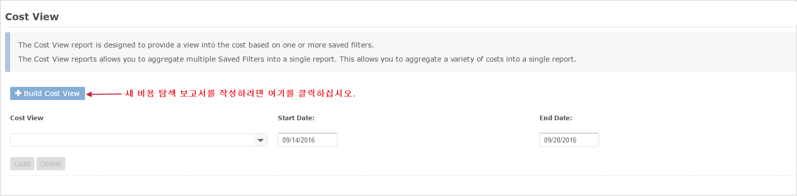

# 비용 탐색 보고서

비용 탐색 보고서를 사용하면 여러 저장된 필터의 비용을 집계할 수 있습니다. 이를 통해 사용자는 기존 저장된 필터를 보고서의 빌딩 블록으로 사용하는 새로운 비용 보고서를 효과적으로 작성할 수 있습니다.\
\
이 보고서에 액세스하려면 왼쪽 탐색 창으로 이동하여\
**Cost > AWS Billing > Custom Reporting > Cost views**를 선택합니다.

비용 상세 분석에 이미 구축된 두 개의 저장된 필터가 있는 기본 예를 살펴보겠습니다. 하나의 저장된 필터 이름은 "Asia Pacific Region Costs"이고 다른 하나는 North America Region Costs 입니다. 비용 탐색 보고서의 기능을 활용하려면 먼저 비용 탐색을 작성해야 합니다. 시작하려면 <mark style="background-color:blue;">**+ Build Cost View**</mark> 라고 표시된 파란색 버튼을 클릭하십시오.

<figure><figcaption>
Cost View 접속 화면
</figcaption></figure>

다음 화면에서 다중 선택 도구를 사용하여 비용 탐색에서 집계할 저장된 필터를 선택합니다.

<figure><figcaption>
+ Build Cost View 클릭시 확인 가능
</figcaption></figure>

비용 탐색이 생성되면 풀다운 메뉴에서 로드할 비용 탐색을 선택하고 보고서를 실행할 날짜 범위를 지정할 수 있습니다. 이름으로 비용 탐색을 선택하고 날짜 범위를 지정한 후 로드 버튼을 클릭하기만 하면 보고서가 로드됩니다.&#x20;
