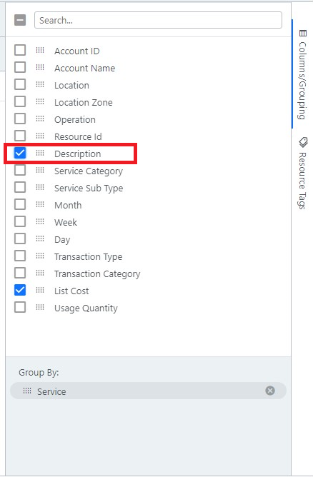

# 비용 비즈니스 인텔리전스

데이터 분석 도구인 **Cost BI**(비용 비즈니스 인텔리전스)라는 기능을 통해 비용 및 사용량에 관한 보다 세부적인 정보를 확인할 수 있습니다.&#x20;

이 보고서에 액세스하려면 왼쪽 탐색 창으로 이동하여 **Cost > Cost BI**를 선택합니다.

<figure><figcaption>
Cost BI 접속 화면
</figcaption></figure>

## 날짜 설정

Date Range(UTC)에서 원하는 날짜를 선택할 수 있습니다.

<figure><figcaption>
날짜 설정 예시
</figcaption></figure>

* **Last full month** : 지난 한달 전체
* **Last full 3 months** : 지난 3개월 전체
* **Last full 6 months** : 지난 6개월 전체
* **Fixed date range** : 고정된 날짜 범위

특정 날짜를 선택하기 위해서는 **Fixed date range** 옵션을 선택합니다.

<figure><figcaption>
Fixed date range 옵션 선택 예시
</figcaption></figure>

**Fixed date range** 옵션을 통해 원하는 범위의 시작일과 종료일을 지정해서 검색할 수 있습니다.

## 검색 옵션 선택

맨 우측 사이드바에서 선택할 수 있는 옵션 **Columns/Grouping** 및 **Resource Tags** 두 옵션을 통해 원하는 세부정보를 필터링하여 사용량 파악이 가능합니다.

### Columns/Grouping

<figure><figcaption>
Columns/Grouping 화면 예시
</figcaption></figure>

**Columns/Grouping**에서 선택할 수 있는 검색 기준 목록은 다음과 같습니다.

<table><thead><tr><th>옵션</th><th>설명</th><th data-hidden></th></tr></thead><tbody><tr><td>Account ID</td><td>계정 번호</td><td></td></tr><tr><td>Account Name</td><td>계정 이름</td><td></td></tr><tr><td>Location</td><td>리전</td><td></td></tr><tr><td>Location Zone</td><td>가용 영역</td><td></td></tr><tr><td>Operation</td><td>작업</td><td></td></tr><tr><td>Resource Id</td><td>리소스 ID</td><td></td></tr><tr><td>Description</td><td>설명</td><td></td></tr><tr><td>Service Category</td><td>서비스 카테고리 별 분류</td><td></td></tr><tr><td>Service</td><td>서비스</td><td></td></tr><tr><td>Service Sub Type</td><td>선택한 서비스의 하위 집합</td><td></td></tr><tr><td>Month</td><td>달</td><td></td></tr><tr><td>Week</td><td>주</td><td></td></tr><tr><td>Day</td><td>일</td><td></td></tr><tr><td>Transaction Type</td><td>거래 유형</td><td></td></tr><tr><td>Transaction Category</td><td>거래 카테고리</td><td></td></tr><tr><td>List Cost</td><td>금액</td><td></td></tr><tr><td>Usage Quantity</td><td>사용량</td><td></td></tr></tbody></table>


**Account** , **Account ID**의 옵션도 동시에 선택 가능합니다.

계정 여러 개를 한 번에 확인하려면 MAV를 통해 접속 후 필터링할 수 있습니다.



필터링 시 **Group By**에 반드시 한 가지 이상의 옵션을 선택해야 하며, 사이드바에서 드래그를 통해 **Group By**에 목록들을 추가할 수 있습니다.


<figure><figcaption>
드래그를 통한 추가 예시
</figcaption></figure>


**Group By**에 추가된 목록들은 고정이 되며, 이후에 추가해서 변경사항을 확인하려는 부가적인 서비스는 목록에 체크를 통해서 필터링할 수 있습니다.

또한, **Group By** 및 부가적인 서비스는 목록을 2개 이상 추가할 수 있습니다.


<figure><figcaption>
'Description' 옵션 선택 예시
</figcaption></figure>

필터 옵션은 항목 옆 필터 아이콘을 클릭하면 선택할 수 있습니다.

<figure><figcaption>
우측 필터 아이콘 클릭
</figcaption></figure>

<figure><figcaption>
필터 옵션 예시
</figcaption></figure>

<table><thead><tr><th width="212"></th><th></th><th data-hidden></th></tr></thead><tbody><tr><td>Equals</td><td>선택한 검색어와 매치하는 값만 필터</td><td></td></tr><tr><td>Does not equal</td><td>선택한 검색어와 매치하지 않는 값만 필터</td><td></td></tr><tr><td>Contains</td><td>선택한 검색어를 포함한 값 필터</td><td></td></tr></tbody></table>

<figure><figcaption>
'elastic' 검색어 입력 후 EC2 서비스 선택 예시
</figcaption></figure>

<figure><figcaption>
EC2 선택 후 확인 가능
</figcaption></figure>

### Resource Tags

기존에 설정된 태그가 있다면 이 옵션을 통해서 필터링할 수 있습니다.

<figure><figcaption>
'name' 키 검색 및 설정 예시
</figcaption></figure>

<figure><figcaption>
'name' 태그 키가 설정된 것을 확인 가능
</figcaption></figure>

name 태그 키를 선택하면 아래와 같은 값을 확인할 수 있습니다.

<figure><figcaption>
'name' 태그 키 값 확인 가능 
</figcaption></figure>

위와 같이 필터링 모양을 클릭하여 키값에 매칭되는 value 값을 필터링할 수 있습니다.

(예시) 'ingestion'이라는 value 값을 검색하기 위해 필터 안에 ingestion을 입력 후 APPLY를 클릭합니다.

<figure><figcaption>
태그 키 값 name 선택 이후 'ingestion'이라는 value값 확인 가능
</figcaption></figure>

