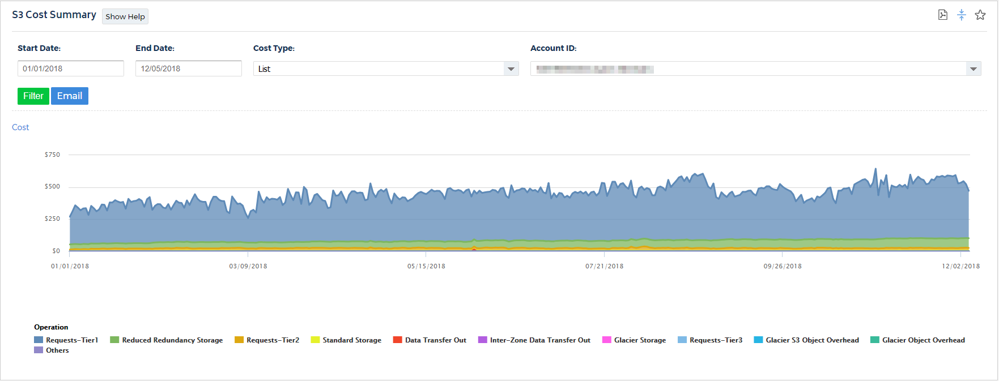

# CloudCheckr로 S3에서 실행 중인 항목 확인

AWS 도구를 사용하여 클라우드 배포를 명확하게 파악하는 것이 항상 쉬운 것은 아닙니다. 이 문제는 S3에서 특히 그렇습니다. S3 버킷에 얼마나 많은 객체가 있는지 또는 얼마나 많은 스토리지가 사용되고 있는지 확인하는 것은 어려운 작업입니다. **CloudCheckr**는 S3 배포 및 비용에 대한 자세한 요약을 제공하여 이 모든 작업을 수행합니다.

이 항목에서는 S3 정보에 액세스할 수 있는 **CloudCheckr** 애플리케이션의 주요 영역을 모듈별로 식별합니다.

## S3 분석 보고서

이 보고서에 액세스하려면 왼쪽 탐색 창으로 이동하여 **Cost > Spend Analysis > S3**를 선택하십시오. \
표에서는 각 보고서에 대해 설명합니다.

<table data-header-hidden><thead><tr><th width="339"></th><th></th></tr></thead><tbody><tr><td><strong>보고서 종류</strong></td><td><strong>설명</strong></td></tr><tr><td><strong>S3 Cost Summary</strong></td><td>S3에서 실행 중인 버킷과 관련된 비용 요약을 제공합니다.</td></tr><tr><td><strong>S3 Storage Cost/Usage</strong></td><td>S3 사용량에 대한 비용 및 데이터 스토리지 양을 보여줍니다.</td></tr><tr><td><strong>S3 Network Cost/Usage</strong></td><td>S3 네트워킹, API 호출 및 비스토리지 사용량에 대한 비용 및 사용량을 보여줍니다.</td></tr><tr><td><strong>S3 Cost Summary (Static Summary)</strong></td><td>스토리지 사용, 클래스 및 지역을 기준으로 다음 달 S3 객체를 저장하는 예상 비용을 계산합니다.</td></tr><tr><td><strong>S3 Static Warnings (Static View)</strong></td><td>S3 비용을 절감할 수 있는 영역을 보여줍니다.</td></tr></tbody></table>

<figure><figcaption>
S3 Cost Summary 예시
</figcaption></figure>

**S3 Summary Report** – S3 배포에 대한 개요를 제공합니다. 보유하고 있는 버킷 및 개체 수와 함께 사용 중인 표준 및 축소 중복 스토리지의 양은 **표시되지 않습니다**. 로깅이 활성화된 버킷 수(및 저장 중인 로그 파일 수), 스토리지 비용, 개체를 저장하는 리전, 평균 개체 크기, 저장 중인 상위 파일 확장자 및 기타 여러유용한 통계도 표시됩니다.

**S3 Details Report** – 버킷별 분석을 제공합니다. 요약에 나열된 모든 통계를 각 버킷에 대해 제공합니다. 또한 각 버킷에서 활성화된 속성과 해당 설정을 보여줍니다. 액세스 권한, 수명 주기 규칙, 로깅 설정 등을 볼 수 있습니다.

**S3 Public Objects Report** – 모든 사람이 사용할 수 있는 개체를 보여줍니다. 이를 통해 의도하지 않게 노출된 개체를 신속하게 식별할 수 있습니다.

**S3 Server Access Logs Report** – 로깅이 활성화된 모든 버킷에 대한 세부 정보를 제공하여 누가 객체에 액세스하고 있는지 보여줍니다.

**S3 Cost Summary** - S3 내에서 실행되는 버킷과 관련된 비용 요약을 표시합니다.
